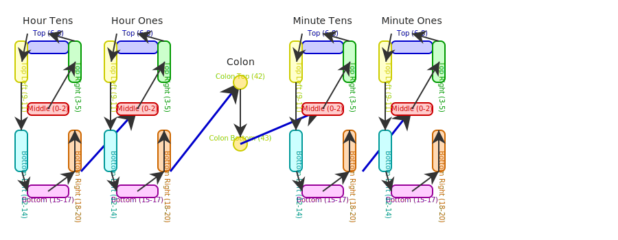

# WiFi Clock (ESP8266 D1 Mini)

A smart LED clock using a D1 Mini (ESP8266) microcontroller and a NeoPixel strip, featuring:
- Automatic time sync via NTP
- Daylight Saving Time (DST) support (Mountain Time, auto-adjusts)
- Automatic dimming after sunset and brightening at sunrise (using your location from IP)
- WiFi credentials kept private via `secrets.h`

---

## Hardware

- **Microcontroller:** D1 Mini (ESP8266)
- **LEDs:** Adafruit NeoPixel strip (WS2812, 100 pixels)
- **Connections:**
  - NeoPixel Data In → D4 (GPIO2) on D1 Mini
  - NeoPixel 5V → 5V on D1 Mini
  - NeoPixel GND → GND on D1 Mini
  - *Optional:* Large capacitor (1000uF, 6.3V+) across 5V/GND, and a 330Ω resistor in series with data line for NeoPixel reliability
- **Power:**
  - Use a 5V USB power supply capable of at least 2A for 100 NeoPixels at high brightness

- **3D Printed Case & Digits:**
  - [Download STL files on Thingiverse](https://www.thingiverse.com/thing:2968056)

---

### Hardware Diagrams

**Wiring Diagram:**


**Clock Layout:**



**Digit Segments:**


---

## Software Setup

1. **Install Arduino IDE** (https://www.arduino.cc/en/software)
2. **Add ESP8266 Board Support:**
   - File > Preferences > Additional Boards Manager URLs:
     - `http://arduino.esp8266.com/stable/package_esp8266com_index.json`
   - Tools > Board > Boards Manager > Search for "ESP8266" and install
   - Select "LOLIN(WEMOS) D1 R2 & mini" as your board
3. **Install Required Libraries:**
   - Tools > Manage Libraries...
     - `NTPClient` by Fabrice Weinberg
     - `Adafruit NeoPixel` by Adafruit
     - `Timezone` by Jack Christensen
     - `Time` or `TimeLib` by Paul Stoffregen
     - `ESP8266HTTPClient` (comes with ESP8266 core)
4. **WiFi Credentials:**
   - Copy `secrets_example.h` to `secrets.h` in the same folder as your `.ino` file
   - Edit `secrets.h` and enter your WiFi SSID and password:
     ```cpp
     #define WIFI_SSID     "YourNetworkName"
     #define WIFI_PASSWORD "YourSuperSecretPassword"
     ```
5. **Open `JIM-DIYCLOCKV2.ino` in Arduino IDE**
6. **Connect your D1 Mini via USB**
7. **Upload the sketch**

---

## Features

- **NTP Time Sync:** Always accurate, updates every 30 seconds
- **Automatic DST:** Mountain Time (MST/MDT), handled by Timezone library
- **Auto Dimming:**
  - Fetches your approximate location via IP at startup
  - Gets sunrise/sunset times for your city/region
  - Dims after sunset, brightens at sunrise
- **WiFi Credentials Security:**
  - Credentials are stored in `secrets.h` (not tracked by git)
  - Share your project safely on GitHub

---

## Customization
- Change `normalBrightness` and `dimBrightness` in the code to adjust display brightness.
- To use a fixed location, set `latitude` and `longitude` variables manually.
- To change time zone, update the Timezone rules in the code.

---

## Troubleshooting
- If `secrets.h` is not found, ensure it is in the same folder as your `.ino` file and visible as a tab in Arduino IDE.
- If NeoPixels flicker or don't light, check wiring, power supply, and add a large capacitor and resistor as recommended.
- If you see library warnings, ensure all libraries are installed as described above.

---

## License
MIT or public domain. Use and modify freely! 